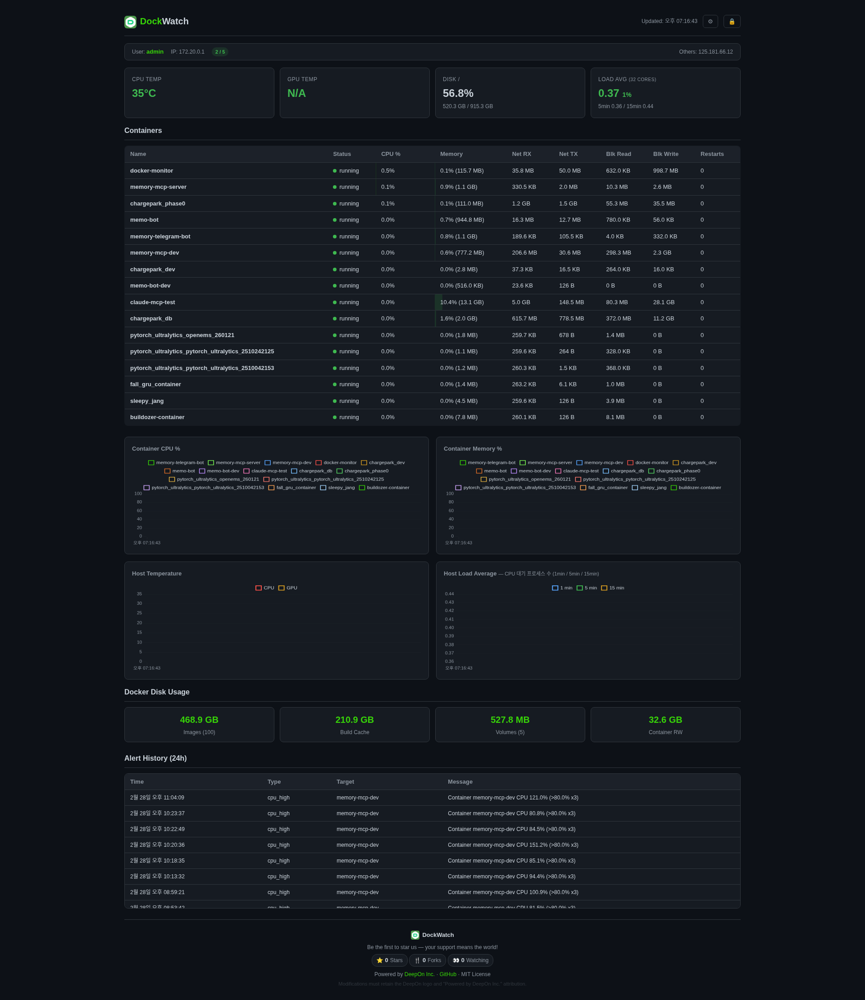

<p align="center">
  
</p>

<h1 align="center">DockWatch</h1>

<p align="center">
  <b>軽量なDocker監視ダッシュボード — 異常検知 & Telegram通知</b><br>
  コンテナ1つ。コマンド1つ。完全な可視性。
</p>

<p align="center">
  <a href="README.md">English</a> | <a href="README.ko.md">한국어</a> | <b>日本語</b> | <a href="README.de.md">Deutsch</a> | <a href="README.fr.md">Français</a> | <a href="README.es.md">Español</a> | <a href="README.pt.md">Português</a> | <a href="README.it.md">Italiano</a>
</p>

<p align="center">
  
  
  
  
</p>

---

## DockWatchとは？

DockWatchは、単一コンテナで動作するセルフホスト型Docker監視ダッシュボードです。すべてのコンテナとホストマシンのCPU、メモリ、ネットワーク、ディスクメトリクスをリアルタイムに収集し、クリーンなダークテーマのWeb UIに表示します。

問題が発生すると、DockWatchが自動的に検知します。6つの異常検知ルールがCPUスパイク、メモリオーバーフロー、温度警告、ディスク圧迫、予期しない再起動、ネットワークサージを監視します。アラートはTelegramに即座に送信され、ユーザーが気づく前に対応できます。

各コンテナにエージェントをインストールする必要はなく、外部データベースも不要で、複雑な設定もありません。Dockerソケットをマウントし、コマンド1つを実行するだけで、`https://localhost:9090`でDocker環境全体を一目で確認できます。

---

## クイックスタート

```bash
git clone https://github.com/deep-on/dockwatch.git && cd dockwatch && bash install.sh
```

以上です。対話型インストーラーが認証、Telegramアラート、HTTPSを自動設定し、`https://localhost:9090`を開きます。

> **必要要件:** Docker (Compose v2)、Git、OpenSSL

---

## ダッシュボードプレビュー

<p align="center">
  
</p>

---

## 主な機能

| カテゴリ | 内容 |
|---------|------|
| **リアルタイムダッシュボード** | ダークテーマWeb UI、10秒自動更新、ソート可能なテーブル、Chart.jsチャート |
| **コンテナ監視** | CPU %、メモリ %、ネットワークI/O、ブロックI/O、再起動回数 |
| **ホスト監視** | CPU/GPU温度、ディスク使用量、ロードアベレージ |
| **異常検知** | 6つのルール — CPUスパイク、メモリオーバーフロー、高温、ディスク満杯、再起動、ネットワークスパイク |
| **Telegramアラート** | 即時通知 + アラートタイプ毎30分クールダウン |
| **セキュリティ** | Basic Auth、レート制限 (5回失敗で60秒ロックアウト)、HTTPS |
| **セッション管理** | アクティブ接続追跡、最大接続数設定、リアルタイムIP表示 |
| **パスワード管理** | ダッシュボードUIからユーザー名/パスワード変更 |
| **設定UI** | ダッシュボードから最大接続数をランタイム変更 |
| **接続方式** | 自己署名SSL (デフォルト) またはCloudflare Tunnel (ポート転送不要) |
| **軽量** | Pythonパッケージ4個、単一HTMLファイル、SQLite 7日間保持 |

---

## ダッシュボード構成

| セクション | 詳細 |
|-----------|------|
| セッションバー | ログインユーザー、IP、アクティブ接続数 / 最大制限 |
| ホストカード | CPU温度、GPU温度、ディスク %、ロードアベレージ |
| コンテナテーブル | CPU/メモリ/ネットワークでソート可能、異常時に赤色表示 |
| チャート (4つ) | コンテナCPU・メモリ推移、ホスト温度・ロード |
| Dockerディスク | イメージ、ビルドキャッシュ、ボリューム、コンテナRWレイヤー |
| アラート履歴 | 直近24時間（タイムスタンプ付き） |

---

## 異常検知ルール

| ルール | 条件 | アクション |
|--------|------|-----------|
| コンテナCPU | >80% 3回連続 (30秒) | Telegram通知 + 赤色ハイライト |
| コンテナメモリ | >90% (limit比) | 即時アラート |
| ホストCPU温度 | >85°C | 即時アラート |
| ホストディスク | >90% 使用 | 即時アラート |
| コンテナ再起動 | restart_count増加 | 即時アラート |
| ネットワークスパイク | RX 10倍急増 + 100MB以上 | 即時アラート |

すべての閾値は環境変数で設定可能です。

---

## アーキテクチャ

```
┌─────────────────────────────────────────┐
│  DockWatch Container                    │
│                                         │
│  FastAPI + uvicorn (port 9090)          │
│  ├── collectors/                        │
│  │   ├── containers.py  (aiodocker)     │
│  │   ├── host.py        (/proc, /sys)   │
│  │   └── images.py      (system df)     │
│  ├── alerting/                          │
│  │   ├── detector.py    (状態マシン)     │
│  │   └── telegram.py    (httpx)         │
│  ├── storage/                           │
│  │   └── db.py          (SQLite WAL)    │
│  └── static/                            │
│      └── index.html     (Chart.js)      │
│                                         │
│  マウントボリューム:                      │
│    docker.sock (ro), /sys (ro),         │
│    /proc (ro), SQLite named volume      │
└─────────────────────────────────────────┘
```

**依存関係 (4パッケージのみ):**
- `fastapi` — Webフレームワーク
- `uvicorn` — ASGIサーバー
- `aiodocker` — 非同期Docker APIクライアント
- `httpx` — 非同期HTTPクライアント (Telegram API)

---

## 設定

`.env`ファイルですべて設定:

```env
# 認証 (必須)
AUTH_USER=admin
AUTH_PASS=your-password

# Telegramアラート (任意)
TELEGRAM_BOT_TOKEN=your-bot-token
TELEGRAM_CHAT_ID=your-chat-id

# 閾値 (任意、デフォルト値表示)
CPU_THRESHOLD=80
MEM_THRESHOLD=90

# 接続制限 (任意、0 = 無制限)
MAX_CONNECTIONS=3

# Cloudflare Tunnel (任意)
CF_TUNNEL_TOKEN=your-tunnel-token
```

---

## 接続方式

### 方法1: ローカル (自己署名SSL) — デフォルト

```bash
bash install.sh   # オプション1を選択
```

`https://localhost:9090` または `https://<サーバーIP>:9090` でアクセス

### 方法2: Cloudflare Tunnel (ポート転送不要)

```bash
bash install.sh   # オプション2を選択、トンネルトークンを入力
```

ルーター設定なしで外部HTTPS接続 — Cloudflareトンネルドメイン経由

---

## APIエンドポイント

| エンドポイント | メソッド | 説明 |
|--------------|---------|------|
| `/` | GET | ダッシュボードHTML |
| `/api/current` | GET | 最新スナップショット (コンテナ + ホスト + イメージ + 異常) |
| `/api/history/{name}?hours=1` | GET | コンテナ時系列データ |
| `/api/history/host?hours=1` | GET | ホスト時系列データ |
| `/api/alerts?hours=24` | GET | アラート履歴 |
| `/api/session` | GET | 現在のユーザー、IP、アクティブ接続数 |
| `/api/settings` | GET/POST | ランタイム設定 (max_connections) |
| `/api/change-password` | POST | ユーザー名/パスワード変更 |
| `/api/health` | GET | ヘルスチェック (認証不要) |

---

## セキュリティ

- **Basic Auth** — 全エンドポイントで認証必須 (`/api/health` を除く)
- **レート制限** — ログイン5回失敗でIPごとに60秒ロックアウト
- **HTTPS** — 自己署名またはCloudflare Tunnel
- **接続数制限** — 最大同時接続ユーザー設定可能
- **読み取り専用マウント** — Docker socket、/sys、/proc すべてread-only
- **制御機能なし** — 監視専用、コンテナ操作不可

---

## 手動セットアップ

インストールスクリプトの代わりに手動設定する場合:

```bash
git clone https://github.com/deep-on/dockwatch.git
cd dockwatch

# .env 設定
cp .env.example .env
vi .env

# SSL証明書生成 (任意)
mkdir -p certs
openssl req -x509 -newkey rsa:2048 -nodes \
  -keyout certs/key.pem -out certs/cert.pem \
  -days 365 -subj "/CN=dockwatch"

# 起動
docker compose up -d --build
```

---

## ライセンス

MIT License — [LICENSE](LICENSE) を参照

**帰属条件:** 修正・再配布版にはDeepOnロゴと「Powered by DeepOn Inc.」の表記をUIに保持する必要があります。

---

<p align="center">
  
  <a href="https://deep-on.com">DeepOn Inc.</a> が開発
</p>
